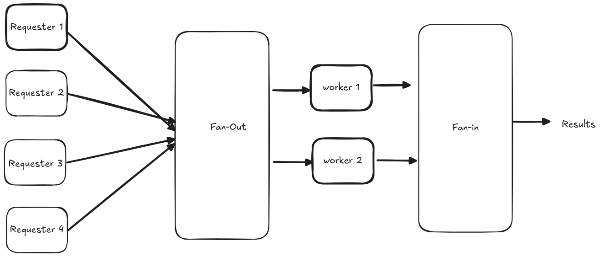

# Fan-Out/Fan-In Pattern

A comprehensive example demonstrating the Fan-Out/Fan-In concurrency pattern in Go.

## Overview

The Fan-Out/Fan-In pattern is a powerful concurrency pattern that:
- **Fan-Out**: Distributes work from one source to multiple workers
- **Fan-In**: Collects results from multiple workers back into a single stream

## Visual Diagram

*The diagram above illustrates the flow of data through the fan-out/fan-in pattern.*

## Pattern Components

### 1. Fan-Out Phase
- Takes input tasks: `[10, 20, 30, 40, 50, 60]`
- Distributes them to 3 workers using round-robin allocation:
  - **Worker 1**: Tasks 10, 40
  - **Worker 2**: Tasks 20, 50 (with 2-second delay)
  - **Worker 3**: Tasks 30, 60

### 2. Processing Phase
- Each worker processes tasks independently
- Simulates work with sleep
- Doubles each input value (task × 2)

### 3. Fan-In Phase
- Collects results from all workers
- Merges them into a single result stream
- Maintains concurrency throughout

## Use Cases

This pattern is ideal for:
- **CPU-intensive tasks** that can be parallelized
- **I/O operations** that can run concurrently
- **Data processing pipelines** with multiple stages
- **Load balancing** across multiple workers
- **Map-Reduce** style operations

## Performance Benefits

- **Parallel Processing**: Multiple workers process tasks simultaneously
- **Resource Utilization**: Better CPU and I/O utilization
- **Scalability**: Easy to add more workers
- **Backpressure Handling**: Buffered channels prevent blocking
